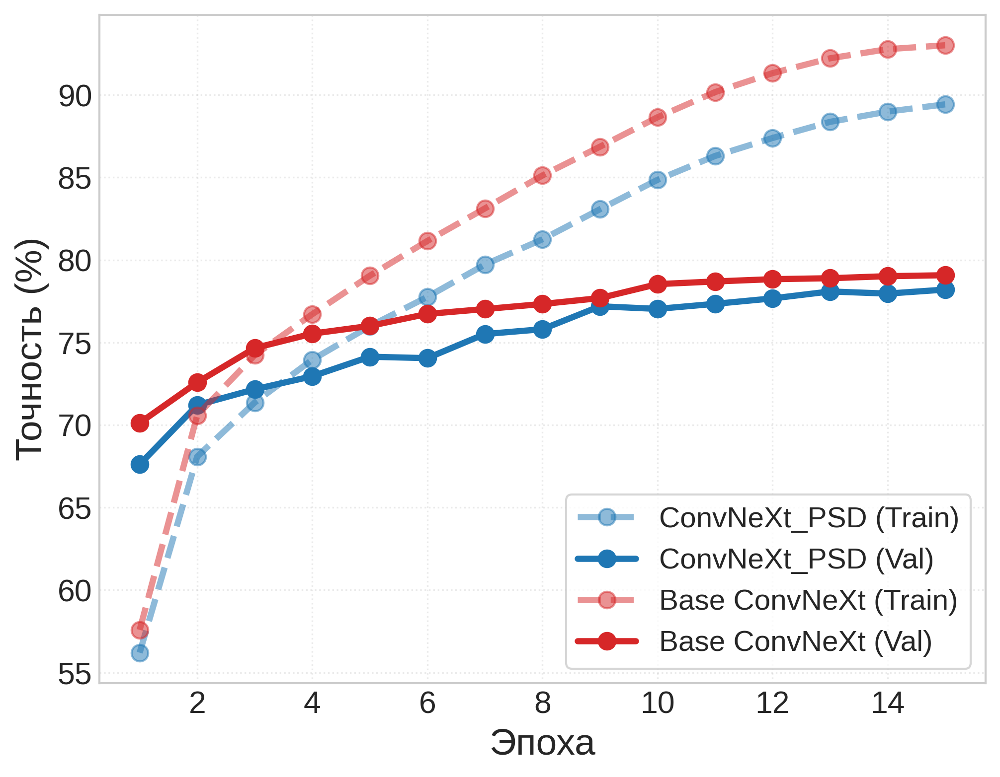
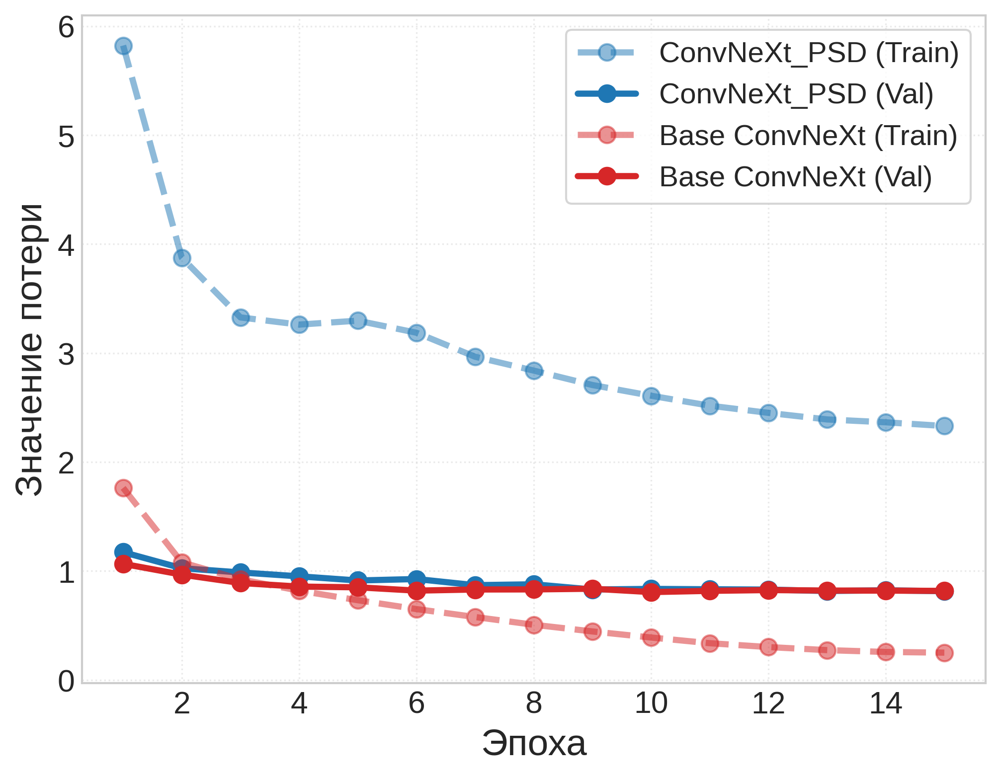

# Исследование эффективности прогрессивной самодистилляции знаний при обучении свёрточных нейронных сетей ConvNeXt в задачах мелкозернистой классификации [](https://colab.research.google.com/github/ss-zerocat/article_convnext_psd/blob/main/src/article_convnext_psd.ipynb)

Этот репозиторий содержит исходный код и инструкции для воспроизведения результатов исследования архитектуры прогрессивной самодистилляции (PSD) на базе ConvNeXt согласно статье [Learn More for Food Recognition via Progressive Self-Distillation](https://doi.org/10.1609/aaai.v37i3.25501).

## Датасет

Используется датасет CNFOOD-241, скачиваемый с [kaggle](https://www.kaggle.com/datasets/zachaluza/cnfood-241).

```python
import kagglehub
path = kagglehub.dataset_download("zachaluza/cnfood-241")
```

### Лицензия

CC BY NC 3.0

范, 博坤 (2022), “CNFOOD-241”, Mendeley Data, V1, doi: 10.17632/fspyss5zbb.1

## Аппаратная среда

### Тип вычислений

Все вычисления проводились в облачной среде DataSphere платформы Yandex Cloud.

### GPU

NVIDIA A100 80GB.

## Программная среда

Код был протестирован на версии `Python 3.10.12`.

## Результаты

Динамики обучения базовой и модифицированной (PSD) моделей на обучающей и валидационной выборках:
<p align="center">
  
  
</p>

## Гиперпараметры

### Общие

* **Количество эпох обучения:** `15`
* **Коэффициент сглаживания распределения вероятностей (temperature):** `3.0`
* **Верхний предел веса дистилляционной функции потерь (alpha):** `1.0`
* **Эпоха выхода функции затухания дистилляции на стационарный режим (beta):** `5`
* **Количество итеративных каскадов внутри PSD блока (m):** `2`
* **Размер батча (Batch Size):** `256`
* **Оптимизатор:** AdamW (`weight_decay = 0.05`)
* **Learning Rate:** `lr = 3e-4`
* **Scheduler**: CosineAnnealingLR (`T_max = total_epochs (15)`, `eta_min = 1e-6`)

### Рандомизация

Используемый `seed = 42` применяется в функции `seed_everything()`:

## Как запустить код?

Запустить исследование можно двумя способами.

### Способ 1: Быстрый запуск

Вернитесь к началу текущего файла [README.md](#исследование-эффективности-прогрессивной-самодистилляции-знаний-при-обучении-свёрточных-нейронных-сетей-convnext-в-задачах-мелкозернистой-классификации-open-in-colab) и нажмите на синюю кнопку **[Open In Colab]**. Блокнот автоматически откроется в облаке (необходимо войти в аккаунт google).

1. В правом верхнем углу интерфейса Colab нажмите кнопку **Подключиться T4***.
   * *Если ускоритель `T4` не отображается, смените среду выполнения вручную: **Среда выполнения** -> **Сменить среду выполнения** -> выбрать **Графический процессор T4** -> нажать **Сохранить**.*
2. После успешного подключения можно поочередно запускать ячейки кода.

### Способ 2: Ручная загрузка файла

Если вам необходимо запустить проект вручную, выполните следующие шаги:

1. Скачайте основной файл кода `replication.ipynb`, расположенный в каталоге `src/`.
2. Перейдите на сайт сервиса [Google Colab](https://colab.research.google.com) под своим Google-аккаунтом.
3. В верхнем меню выберите **Файл** -> **Загрузить блокнот** и перетащите в появившееся окно скачанный файл `replication.ipynb`.
4. В правом верхнем углу интерфейса Colab нажмите кнопку **Подключиться T4**.
   * *Если ускоритель `T4` не отображается, смените среду выполнения вручную: **Среда выполнения** -> **Сменить среду выполнения** -> выбрать **Графический процессор T4** -> нажать **Сохранить**.*
5. После успешного подключения можно поочередно запускать ячейки кода.

\* - для обучения мощностей gpu T4 может быть недостаточно.

## Наличие предварительно обученных весов

Веса моделей можно скачать по следующим ссылкам:

* [Базовая](https://disk.yandex.ru/d/RFlBAQzKiy0IsA)
* [PSD](https://disk.yandex.ru/d/PIcWyD09qtIoNw)
